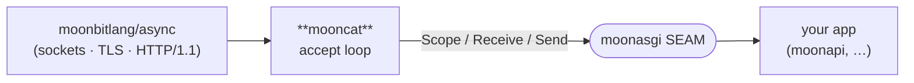

<div align="center">

# mooncat

**A native ASGI 3.0 server for MoonBit — `← uvicorn`.**

[](https://github.com/Lfan-ke/mooncat/actions/workflows/ci.yml)
[](./LICENSE)
[](https://mooncakes.io/docs/Lfan-ke/mooncat)

</div>

`mooncat` runs a [`moonasgi`](https://github.com/Lfan-ke/moonasgi) application over a real network socket. It sits between `moonbitlang/async`'s native HTTP transport and the ASGI SEAM: it accepts connections, turns each request into a `Scope` + `Receive` + `Send`, and drives your app — exactly the role `uvicorn` plays for Python.



## Quickstart

```moonbit
// An ASGI app: respond 200 with a text body.
let app : @moonasgi.AsgiApp = (_scope, _receive, send) => {
  send(@moonasgi.Event::HttpResponseStart(
    status=200, headers=[("content-type", "text/plain")]))
  send(@moonasgi.Event::HttpResponseBody(
    body=b"Hello from mooncat!", more_body=false))
}

// Serve it (inside an async context / task group):
@mooncat.serve(app, host="127.0.0.1", port=8000)
```

`serve` blocks in a keep-alive accept loop until its task is cancelled. Each request is bridged faithfully: the method/path/query/headers become an `http` `Scope`, the request body streams through `Receive`, and `HttpResponseStart` / `HttpResponseBody` events are written back via the connection.

## Status

`v0` — HTTP/1.1 request → ASGI `Scope`/`Receive`/`Send` → response is **working and verified by a real socket round-trip in CI** (a server task answers a live `@http.get`). Landed and CI-verified alongside it:

- the **lifespan** protocol — the app runs once under a `Lifespan` scope, `startup` is driven before the listener binds and `shutdown` on the way out, even under cancellation;
- the **full WebSocket frame↔`Event` bridge** — a `Connection: upgrade` + `Upgrade: websocket` handshake becomes a `websocket` `Scope` driven through the moonasgi SEAM: `receive()` emits `websocket.connect` then real inbound text/binary frames as `WebSocketReceive` (streamed through the `Message`-as-`Reader`, so fragments reassemble) and a peer close as `WebSocketDisconnect(code)`; `send()` turns `WebSocketAccept` into the deferred 101 handshake, `WebSocketSendText`/`WebSocketSendBytes` into message frames, and `WebSocketClose(code, reason)` into a close frame. Rejecting before accept answers `403`; ping/pong are auto-handled at the protocol layer (as in uvicorn). Proven by a **real `@websocket` client** doing a full text + binary round-trip and a clean close in CI;
- a `Config` exposing the HTTP/1.1 transport knobs the async server honours — `dual_stack`, `reuse_addr`, per-server response `headers`, `max_connections`, and `allow_failure` — on top of host/port/backlog. Keep-alive and chunked request/response framing are handled automatically by the async transport.

Roadmap, transliterated from uvicorn feature-by-feature: subprotocol echo into the 101 response (awaits a transport hook), the self-built HTTP/1.1 parser knobs (`Expect: 100-continue`, buffer limits), TLS detail (ciphers/mTLS), and the multi-process prefork supervisor with `--reload`.

## Native only

The `moonbitlang/async` HTTP **server** is native-only (Linux/macOS) — there is no JS server backend — so `mooncat` builds and runs on the `native` target. CI covers `ubuntu` + `macos`.

## License

Apache-2.0.
